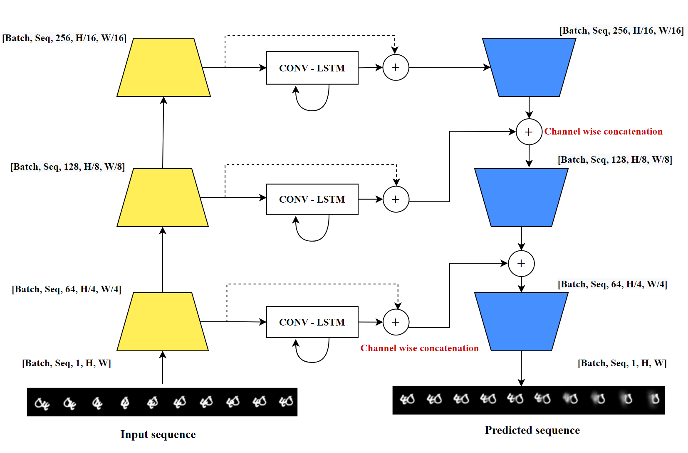

  [![Contributors][contributors-shield]][contributors-url] [![Forks][forks-shield]][forks-url] [![Stargazers][stars-shield]][stars-url] [![Issues][issues-shield]][issues-url] [![MIT License][license-shield]][license-url] [![LinkedIn][linkedin-shield]][linkedin-url]

<!-- PROJECT LOGO -->
<br />

<p align="center">
  <a href="https://github.com/here-to-learn0/Video_frame_prediction">
    
  </a>
  <h3 align="center">Video Frame Prediction</h3>
  <p align="center">
    Video Frame Prediction using Convolutional LSTM
    <br />
    <a href=https://github.com/here-to-learn0/Video_frame_prediction><strong>Explore the repository»</strong></a>
    <br />
    <a href=https://github.com/here-to-learn0/Video_frame_prediction/blob/master/docs/report.pdf>View Report</a>
  </p>

</p>

> tags : video prediction, frame prediction, spatio temporal, convlstms, movingmnist, kth, deep learning, pytorch 


<!-- ABOUT THE PROJECT -->

## About The Project 

Video Frame Prediciton is the task in computer vision which consists of providing a model with a sequence of past frames, and asking it to generate the next frames in the sequence (also referred to as the future frames). Despite the fact that humans can easily and effortlessly solve the future frame prediction problem, it is extremely challenging for a machine. The fact that the model needs to understand the physical dynamics of motion in real world makes this task complex for machines. This task has many downstream applications in autonomoous driving like predicting future state of agents, thus detecting moving objects from a sequence. Here we present our approach which explots Convolutional Layers for feature encoding and decoding, Convolutional LSTMs for predicting future frames of Moving MNIST and KTH dataset. A detailed description of algorithms and analysis of the results are available in the [report](./docs/report.pdf). 
<!-- Add pdf link here -->


### Built With
This project was built with 

* python v3.8.12
* PyTorch v1.10
* The environment used for developing this project is available at [environment.yml](environment.yml).


<!-- GETTING STARTED -->

## Getting Started

Clone the repository into a local machine and enter the Video_frame_prediction directory using

```shell
git clone https://github.com/here-to-learn0/Video_frame_prediction
cd Video_frame_prediction/
```

### Prerequisites

Create a new conda environment and install all the libraries by running the following command

```shell
conda env create -f environment.yml
```

The datasets used in this project are Moving MNIST and KTH. Moving MNIST will will be automatically downloaded and setup in `data` directory during execution. However, KTH video sequence files have to be downloaded and placed in the data directly as given below.

```
data/
└── kth/
    ├── boxing 
    ├── handclapping
    ├── handwaving
    ├── jogging
    ├── running
    └── walking
```


### Instructions to run

To train and evaluate the model use the commands listed below:

```sh
python scripts/main.py  -c dataset_config.yaml --lr_warmup True --add_ssim True --criterion loss_function -s scheduler
```
-c corresponds to the config file , the two config files kth.yaml and mnist.yaml which are present in the configs folder.

--lr_warmup - this flag is set to True if LR warmup is to be applied to the schedulers that are used else it is set to False.

--add_ssim - this flag is set to True if SSIM is to be used as a combined loss function for training along with MSE or MAE else it is set to False.

--criterion - this corresponds to the loss function criterion which is used for training, it has two values 'mae' or 'mse'.

-s corresponds to the type of scheduler that is used,its values are 'exponential' or 'plateau' for the two schedulers used are Exponential LR and ReduceLROnPlateau 

This trains the frame prediction model and saves model after every 5th epoch in the `model` directory.

This generates folders in the `results` directory for every log frequency steps. The folders contains the ground truth and predicted frames for the test dataset. These outputs along with loss are written to Weights and Biases as well.

Once training is completed and the models are saved, the evaluate_model.py file can be used to calculate the following metrics for the model :
MSE,MAE,PSNR,SSIM and LPIPS.

This evaluation can be run using the following command:
```sh 
python scripts/evaluate_model.py -d moving_mnist -mp model_path -s tensor_saving_path
```

-d corresponds to the dataloader used ,the values are 'moving_mnist' and 'kth' for the Moving Mnist and KTH Action Dataset.

-mp corresponds to the path along with the model name and type (example: models/mnist/model_50.pth) where the model is stored.

-s corresponds to the path where the tensors for the metrics are stored (example: results_eval/mnist)


## Model overview

The architecture of the model is shown below. First, all 10 gt frames are inputted to the encoder which makes feature embeddings at levels. Then, three different ConvLSTM takes these feature embeddings at different levels and predicts the feature embeddings for the next 10 frames like a sequence-to-sequence manner. Then these predicted embeddings from differnt levels are passed through the decoder, which gives us the 10 predicted frames. 


<!-- RESULTS -->

## Results

Detailed results and inferences are available in report [here](./docs/report.pdf).

We evaluate the performance of the best model(trained with SSIM and MSE using ReduceLROnPlateau Schedular with LR warmup) on MovingMNIST and KTH dataset. The quantitative results of our model performance for both the datasets is given below.

|Dataset  |  MSE | MAE | PSNR  | SSIM   |  LPIPS  |
|---------|---------|--------|---------|--------|-------|
|MovingMNIST | 0.028 |0.061  | 15.806   | 0.650   |   0.194     
|KTH        | 0.043 | 0.179  |  14.373 |  0.77   | 0.239        


       
<!-- CONTACT -->

## Contact
Vardeep Singh Sandhu - s7vasand@uni-bonn.de


Aysha Athar Siddiqui - s6aysidd@uni-bonn.de


Sugan Kanagasenthinathan - s6sukana@uni-bonn.de


Project Link: [https://github.com/here-to-learn0/Video_frame_prediction](https://github.com/here-to-learn0/Video_frame_prediction)


## Acknowledgments

 This project is not possible without multiple great opensourced codebases. We list some notable examples below.


> https://github.com/edenton/svg
> https://github.com/vkhoi/KTH-Action-Recognition 
> https://github.com/CeeBeeTree/KTH-Action-Recognition
> https://github.com/pytorch/vision/blob/7947fc8fb38b1d3a2aca03f22a2e6a3caa63f2a0/torchvision/models/resnet.py#L37
> https://holmdk.github.io/2020/04/02/video_prediction.html


<!-- MARKDOWN LINKS & IMAGES -->
<!-- https://www.markdownguide.org/basic-syntax/#reference-style-links -->

[contributors-shield]: https://img.shields.io/github/contributors/here-to-learn0/Video_frame_prediction.svg?style=flat-square
[contributors-url]: https://github.com/here-to-learn0/Video_frame_prediction/graphs/contributors
[forks-shield]: https://img.shields.io/github/forks/here-to-learn0/Video_frame_prediction.svg?style=flat-square
[forks-url]: https://github.com/here-to-learn0/Video_frame_prediction/network/members

[stars-shield]: https://img.shields.io/github/stars/here-to-learn0/Video_frame_prediction.svg?style=flat-square
[stars-url]: https://github.com/here-to-learn0/Video_frame_prediction/stargazers

[issues-shield]: https://img.shields.io/github/issues/here-to-learn0/Video_frame_prediction.svg?style=flat-square
[issues-url]: https://github.com/here-to-learn0/Video_frame_prediction/issues

[linkedin-shield]: https://img.shields.io/badge/-LinkedIn-black.svg?style=flat-square&logo=linkedin&colorB=555
[linkedin-url]: https://www.linkedin.com/in/vardeep-sandhu/
